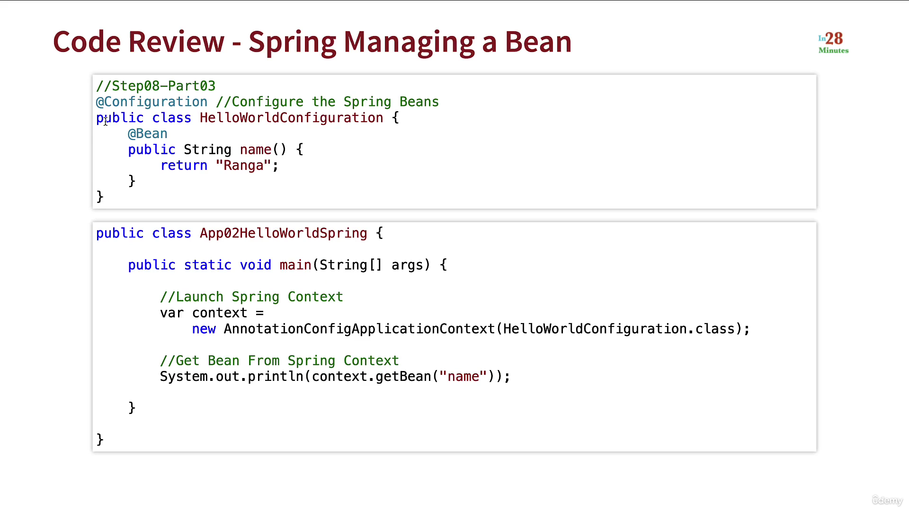
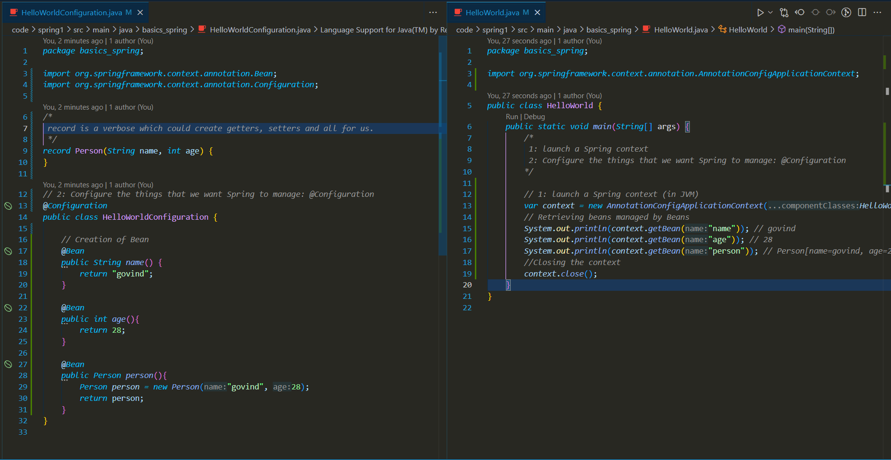
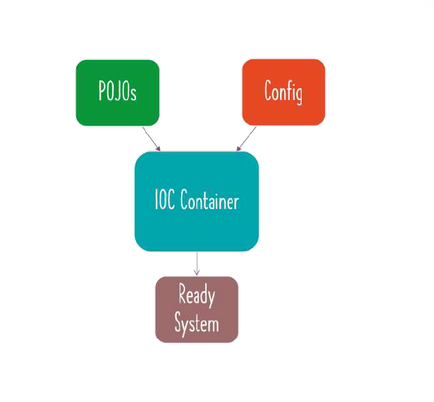
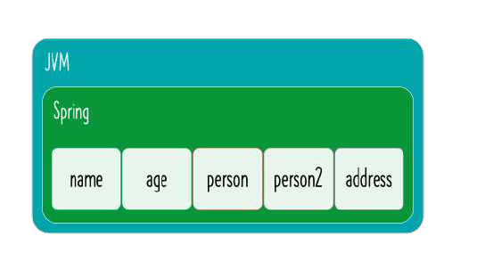
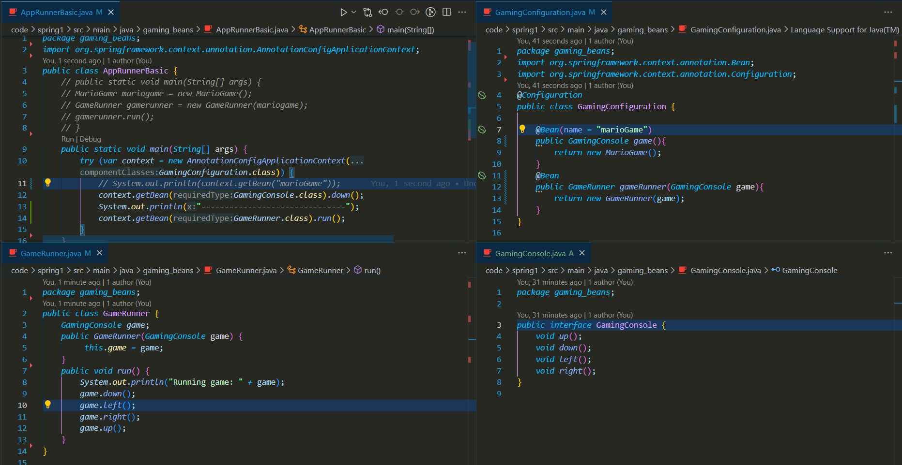

### Basics:

#### Gaming Example:
##### Tight Coupling:


##### Loose coupling (using interface).


#### Spring

- Configuration:
  - Indicates that a class declares one or more @Bean methods and may be processed by the Spring container to generate bean definitions and service requests for those beans at runtime, for example:
  - Bootstrapping @Configuration classes Via AnnotationConfigApplicationContext @Configuration classes are typically bootstrapped using either AnnotationConfigApplicationContext or its web-capable variant, AnnotationConfigWebApplicationContext.
  - Configuration Class
  ```
  org.springframework.context.annotation.Configuration
  @Configuration
  public class AppConfig {
      @Bean
      public MyBean myBean() {
          // instantiate, configure and return bean ...
      }
  }
  ```
  - Spring class:
  ```
  AnnotationConfigApplicationContext ctx = new AnnotationConfigApplicationContext();
  ctx.register(AppConfig.class);
  ctx.refresh();
  MyBean myBean = ctx.getBean(MyBean.class);
  ```
- Class objects which are managed by Spring are called as **Beans**.
  
- Code Review - Spring Managing a bean
  
- Bean creation and accessing
  
- More Beans

  ```
  @Bean
  public String name() {
      return "govind";
  }
  -----------------------------------
  System.out.println(context.getBean("name")); // govind

  ```

  

- Accessing bean with custom name:
  ```
  @Bean(name = "personGovind")
  public Person person(){
      Person person = new Person("govind", 28);
      return person;
  }
  -------------------------------
  System.out.println(context.getBean("personGovind")); // Person[name=govind, age=28]
  ```
  
- Accessing bean with Class name:
  ```
  System.out.println(context.getBean(Person.class)); // Person[name=govind, age=28]
  ```
  
- Reusing Existing Spring Beans for Auto Wiring:

  - Here we can use existing beans and can pass to other beans. This can be done in 2 ways.

    - Method call:

    ```
    record FullDetails(String name, int age, Address address){
    }

    record Address(String landmark, String city) {
    }

    @Bean
    public String name() {
        return "govind";
    }

    @Bean
    public int age() {
        return 28;
    }

    @Bean
    public Address address(){
        return new Address("ICICI Bank towers", "Gachibowli");
    }

    @Bean(name = "BeanWithMethodCall")
    public FullDetails fullDetails(){
        return new FullDetails(name(), age(), address());
    }

    -----------------------
    System.out.println(context.getBean("BeanWithMethodCall")); // FullDetails[name=govind, age=28, address=Address[landmark=ICICI Bank towers, city=Gachibowli]]
    ```

    - Parameter way:

    ```
    record FullDetails(String name, int age, Address address){
    }

    record Address(String landmark, String city) {
    }

    @Bean
    public String name() {
        return "govind";
    }

    @Bean
    public int age() {
        return 28;
    }

    @Bean
    public Address address2(){
        return new Address("Tellapur", "Hyderabad");
    }

    @Bean
    public FullDetails fullDetailsWithParam(String name, int age, Address address2){
        return new FullDetails(name, age, address2);
    }

    -----------------------
    System.out.println(context.getBean("fullDetailsWithParam")); // FullDetails[name=govind, age=28, address=Address[landmark=Tellapur, city=Hyderabad]]
    ```

#### Spring Basic Topics:


##### Spring Container:
- It manages spring beans and their life-cycle.
- Following are the inputs to create a spring container.
  
- Output is **Ready System** i.e Inside the JVM, we have a spring context which is managing all the beans that we have configured.
  
- Others words refer to spring container are:
  - Spring Context
  - IOC Container [ Inversion of Control ]
- There are 2 popular types of IOC Containers:
    - **Bean Factory**: Basic Spring container
    - **Application Context**: Advanced Spring Contianer with **enterprise specific features**:
        - Easy to use in web applications
        - Easy internationalization
        - Easy integration with Spring AOP.
- Most used container is **Application Context**
- Bean factory can be used for some kind of IoT applications where you're severely constrained for memory. 
##### Exploring Java Bean vs POJO vs Spring Bean:
* **POJO** [ Plain Old Java Object ]:
    - No Constrainsts at all
    - Any Java object is a POJO
    - Example:
    ```
    public class POJO{
        private String name;
        private int age;
        public String toString(){
            return name + " : " + age;
        }
    }

    var pojo = new POJO();
    System.out.println(pojo) // null : 0
    ```
* **Java Beans**:
    - Classes should fulfill 3 Constraints:
        - No argument constructor i.e., having public default.
        - Allow access to their properties using getter and setter methods.
        - implements Serializable
    - These are used 15 years back and these are called as EJB [ Enterprise Java Bean ]
    ```
    package pojo_javaBean_springBean;
    import java.io.*;

    // 3. implements Serializable
    public class JavaBean implements Serializable {

        // 1. No argument constructor.
        public JavaBean() {

        }

        private String name;
        private int age;

        // 2. Allow access to their properties using getter and setter methods.
        public String getName() {
            return name;
        }

        public void setName(String name) {
            this.name = name;
        }

        public int getAge() {
            return age;
        }

        public void setAge(int age) {
            this.age = age;
        }
    }
    ```


* **Spring Bean**:
    - Any java object managed by Spring.
    - Spring uses IOC Container [Bean factory or Application Context] to manage these objects.
- How to list all the beans managed by Spring framework: 
    ```
        System.out.println("=========================================================");
        Arrays.stream(context.getBeanDefinitionNames()).forEach(System.out::println);
        System.out.println("=========================================================");
        /*
        =========================================================
            org.springframework.context.annotation.internalConfigurationAnnotationProcessor
            org.springframework.context.annotation.internalAutowiredAnnotationProcessor
            org.springframework.context.annotation.internalCommonAnnotationProcessor
            org.springframework.context.event.internalEventListenerProcessor
            org.springframework.context.event.internalEventListenerFactory
            helloWorldConfiguration
            name
            age
            personGovind
            address
            BeanWithMethodCall
            address2
            fullDetailsWithParam
            =========================================================
        */
    ```
- What if multiple beans are available ?
    - Problem: **NoUniqueBeanDefinitionException** error occurs for the following  
    ```
    @Bean(name = "personGovind")
    public Person person() {
        Person person = new Person("govind", 28);
        return person;
    }
    @Bean(name = "personGovind2")
    public Person person2() {
        Person person = new Person("govind", 28);
        return person;
    }

    ================
    System.out.println(context.getBean(Person.class));
    ================

    Exception in thread "main" org.springframework.beans.factory.NoUniqueBeanDefinitionException: No qualifying bean of type 'basics_spring.Person' available: expected single matching bean but found 2: personGovind,personGovind2
    ```
    - This can be handled by 2 annotations:
        - Primary
        - Qualifier 
    - @Primary: When we try to access context.getBean(Person.class), it will get confuse to access between Person class beans  personGovind,personGovind2. So in below code, we have used @Primary annotation on the top of bean named "personGovind" and now Person.class will access this bean.
        ```
        import org.springframework.context.annotation.Bean;
        import org.springframework.context.annotation.Configuration;
        import org.springframework.context.annotation.Primary;
        
        @Bean(name = "personGovind")
        @Primary
        public Person person() {
            Person person = new Person("govind", 28);
            return person;
        }
        @Bean(name = "personGovind2")
        public Person person2() {
            Person person = new Person("rama", 25);
            return person;
        }

        ================
        System.out.println(context.getBean(Person.class)); // Person[name=govind, age=28]
        ```
    - @Qualifier: If there are multiple beans of same class type and if we want to use some particular type, using @Qualifier("<qualifierName>") and if we give before the bean where we want, we can access that.

        - Before:
            ```
            @Bean
            public FullDetails fullDetailsWithQualifier(String name, int age, Address address2){
                return new FullDetails(name, age, address2);
            }
            ```
        - Now:
            ```
                @Bean
                public FullDetails fullDetailsWithQualifier(String name, int age, @Qualifier("addressQualifier") Address address2){
                    return new FullDetails(name, age, address2);
                }
            ```

        ```
        import org.springframework.beans.factory.annotation.Qualifier;
        import org.springframework.context.annotation.Bean;
        import org.springframework.context.annotation.Configuration;
        import org.springframework.context.annotation.Primary;

        @Bean
        @Qualifier("addressQualifier")
        public Address address2(){
            return new Address("Tellapur", "Hyderabad");
        }

        @Bean
        public FullDetails fullDetailsWithQualifier(String name, int age, @Qualifier("addressQualifier") Address address2){
            return new FullDetails(name, age, address2);
        }

        ===================================
        System.out.println("fullDetailsWithQualifier: " + context.getBean("fullDetailsWithQualifier"));

        // fullDetailsWithQualifier: FullDetails[name=govind, age=28, address=Address[landmark=Tellapur, city=Hyderabad]]
        ```
##### Application of Beans in Gaming example:
- 


#### MISC:

- record:

  - eliminate verbosity in creating Java beans.
  - Public accessor methods and constructor,
  - equals, hashcode, toString are automatically created.
  - released in JDK 16.
  - Normal way:

  ```
  public class Person {
      private String name;
      private int age;

      public Person(String name, int age) {
          this.name = name;
          this.age = age;
      }

      // Getter and setter methods for name and age (if needed)

      @Override
      public String toString() {
          return "Person[name=" + name + ", age=" + age + "]";
      }
  }
  ```

  - Using record:

  ```
  record Person(String name, int age){}
  ```
