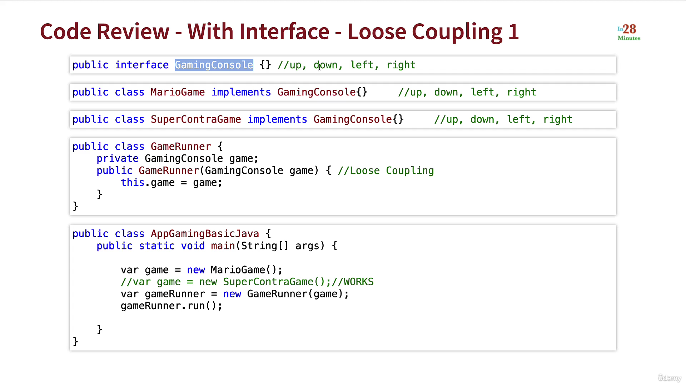
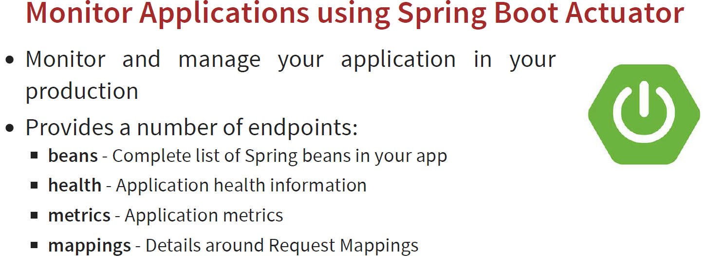

### Basics:

#### Gaming Example:

##### Tight Coupling:


##### Loose coupling (using interface).





#### Spring:

- ##### Spring Core
    - Spring Core is the heart of entire Spring. It contains some base framework classes, principles and mechanisms.
    - Spring Core contains following important components:
        - IoC [Inversion of Control]
        - DI [Dependency Injection]
        - Beans
        - Context
        - SpEL [Spring Expression Language]
        - IoC Container
- ##### Inversion of Control and Dependency Injection:
    - Inversion of Control: 
        - IoC is a software design principle, independent of language, which doesn't acually creates the object but describe the way in which object is being created.
        - Here control flow of program is inverted i.e: 
            - instead of the programmer, framework takes over the control of the program flow. 
    - Dependency Injection:
        - It is the pattern through which the IOC is achieved.
        - With this, responsibility of object creation is shifted from the application to the Spring IoC Container. 
        - It reduces coupling between mutliple objects as it is dynamically injected by the framework.
    - Advantages of IoC and DI are:
        - Loose coupling between the components
        - Minimises the code
        - Makes unit testing easy with different mocks
        - Increased system maintainability and module reusability
        - Allows concurrent or independent development
        - Replacement of modules has no side effect on other modules.
- ##### Spring Bean:
    - Any normal class i.e instantiated, assembled and otherwise managed by a spring IoC container is called Spring Bean.
    - Using **XML config** or **Annotations** confiurations, IoC create beans for us.
    - ```POJO === [Spring Framework] ===> Bean```
    - If we create object like the below way, then Spring have no clue of the object
        ```
            GamingConsole game = new GamingConsole();
        ```
    - Bean creation can be done by 2 annotatons viz.,:
        - @Bean 
        - @Component
    - @Bean annotation:
        - lets spring know that it needs to call this method when it initializes its context and add the returned object to IoC. And the code is
            ```
                @Bean
                public GamingConsole marioGame(){
                    return new GamingConsole;
                }
            ```
    - @Component:
        - most used stereotype annotation by the developers.
        - Comparing with @Bean option, this way is easy to create bean with less code.
        - With sterotype annotations, we need to add the annotation above the class for which we need to have an instance in the spring context.
            ```
                @Component
                public class MarioGame implements GamingConsole{
                   `<Code inside>`
                }
            ```
        - Here it creates MarioGame bean. 
        - **@PostConstruct**:
            - Using this annotation, we can't have control while creating a bean. But if we want to execute some executions post Spring creates the bean, @PostConstruct annotation can be used. 
            - Create a method and on the top of that give @PostConstruct which instructs Spring to execute that method after it finishes bean creation. And that method will be executed automatically just after bean creation
            - Spring borrows this concept from Java EE.
                ```
                    @Component
                    public class MarioGame implements GamingConsole{
                        `<Code inside>`

                        @PostConstruct
                        public void intialize(){
                                System.out.println("Method invoked after bean creation");
                        }
                    }
                ```
        - **@PreDestroy**:
            - This annotation can be used on the top of the method and Spring will call this method just before clearing and destroying the context.
            - This can be used in the scenarios where we want to close any IO resources, Database connections etc.
            - Spring borrows this concept from Java EE.
                ```
                    @Component
                    public class MarioGame implements GamingConsole{
                        `<Code inside>`

                        @PreDestroy
                        public void destroy(){
                                System.out.println("Method invoked just before context closed");
                        }
                    }
                ```
            - context.close() is to be written else this destroy method is not called.
    - **Adding new beans programatically**:
        - From Spring 5 version, context object is provided with **registerBean** method to register a bean.
        ```
        Person govindPerson = new Person("govind", 28);
        Supplier<Person> govindSupplier = () -> govindPerson;

        Supplier<Person> ramSupplier = () -> {
            return new Person("Ram", 25);
        }

        Random random = new Random();
        int randomNum = random.nextInt(10);

        if(randomNum % 2 == 0){
            context.registerBean("govindBean", Person.class, govindSupplier);
        }else{
            context.registerBean("ramBean", Person.class, ramSupplier);
        }
        ```
        
    - **Adding new beans using XML Configs**:
        - This XML way of creation of beans is older way and in older projects, they may use.
        - bean.xml
        ```
            <?xml version="1.0" encoding="UTF-8"?>
            <beans xmlns="http://www.springframework.org/schema/beans"
                xmlns:xsi="http://www.w3.org/2001/XMLSchema-instance"
                xsi:schemaLocation="http://www.springframework.org/schema/beans http://www.springframework.org/schema/beans/spring-beans.xsd">

                <bean id="vehicle" class="com.example.beans.Vehicle">
                    <property name="name" value="Honda" />
                </bean>
                <bean id="person" class="_8_dependency_injection">
                    <property name="name" value="Govind" />
                </bean>
            </beans>


            ============================
            var context = new ClassPathXmlApplicationContext("bean.xml");
            context.getBean(Person.class) // name="govind"
        ```
    - ###### Bean scope inside Spring:
        - ###### Singleton Scope:
            - Default scope of a bean.
            - for a single bean, always we get a same instance when we refer or autowired inside the application.
                ```
                    -------------[Bean Class]-------------
                    @Component
                    @Scope(BeanDefinition.SCOPE_SINGLETON)
                    public class SingletonBeanClass {
                        
                    }

                    -------------[Configuration Class]-------------
                    @Component
                    @ComponentScan
                    public class BeanScopeApp {
                        public static void main(String[] args) {
                            AnnotationConfigApplicationContext context = new AnnotationConfigApplicationContext(BeanScopeApp.class);
                            SingletonBeanClass singletonBean1 = context.getBean(SingletonBeanClass.class);
                            SingletonBeanClass singletonBean2 = context.getBean(SingletonBeanClass.class);
                            System.out.println("singletonBean1's hashCode ==> " + singletonBean1.hashCode());
                            System.out.println("singletonBean2's hashCode ==> " + singletonBean2.hashCode());
                            context.close();
                        }
                    }

                    -------------[Output]-------------
                    singletonBean1's hashCode ==> 587153993
                    singletonBean2's hashCode ==> 587153993
                ```
            - singletonBean1's hashCode and singletonBean2's hashCode are same i.e 587153993. 
            - **Race Condition**:
                - A race condition occurs when 2 threads access a shared variable at the same time. 
                - The 1st and 2nd threads perform their operations on the value, and they race to see which thread can write the value last to the shared variable.
                - The value of the thread that writes its value last is preserved.
                - Race condition can be avoided by **Synchronization** but it is not recommended since it brings a lot of complexity and performance issues.
                - Always try to avoid mutable singleton beans.
                
                - **Use Cases**:
                    - Beans should be **immutable** since same instance of singleton beans can be used by multiple threads.
                    - More suitable for beans which handles
                        - service layer
                        - repository layer business logics.
            - **Eager & Lazy Instantiation**:
                - By default Spring will create all the singleton beans eagerly during the startup of the application itself. This is called **Eager instantiation**.
                - With **@Lazy** annotation written on the top of the Bean class, we can change this behavior and bean will get created when it is refered. 
                - Code:
                    ```
                        ------------Eager_bean.java------------
                        @Component
                        @Scope(BeanDefinition.SCOPE_SINGLETON)
                        public class _2_SingletonBean_Eager {

                            @PostConstruct
                            public void runAfterBeanCreation(){
                                System.out.println("_2_SingletonBean_Eager bean is created now");
                            }
                        }
                        
                        ------------Lazy_bean.java------------
                        @Component
                        @Scope(BeanDefinition.SCOPE_SINGLETON)
                        @Lazy
                        public class _2_SingletonBean_Lazy {
                            
                            @PostConstruct
                            public void runAfterBeanCreation(){
                                System.out.println("_2_SingletonBean_Lazy bean is created now");
                            }
                        }

                        ------------[Configuration Class]------------
                        @Component
                        @ComponentScan
                        public class _0_BeanScopeApp {
                            public static void main(String[] args) {
                                AnnotationConfigApplicationContext context = new AnnotationConfigApplicationContext(_0_BeanScopeApp.class);
                                System.out.println("===============================[Before Logic]===============================");
                                _2_SingletonBean_Lazy lazyBean = context.getBean(_2_SingletonBean_Lazy.class);
                                System.out.println("===============================[After Logic]===============================");
                                context.close();
                            }
                        }

                        ------------[Output]------------
                        _2_SingletonBean_Eager bean is created now
                        ===============================[Before Logic]===============================
                        _2_SingletonBean_Lazy bean is created now
                        ===============================[After Logic]===============================
                    ```
                - Here eager bean is not referred, still it's bean is created.
            - Eager vs Lazy beans:
            
        - Prototype
        - Request
        - Session
        - Application
        
- ##### Wiring or Autowiring:
    - It is always our responsibility to understand the dependencies of beans and have to wire them. This concept is called Wiring or Autowiring. 
    - Beans will be created by Spring but wiring should be done by us.
    - Without wiring: [Beans are created but each one is independent]
        - Scenario
            ```
            ___________________________________________
            |   [SuperMario]                            |
            |                                           |
            |                   [SuperContra]           |
            |          [GameRunner]                     |
            --------------------------------------------
            ```
        - Code:
            ```
                @Configuration
                public class GameConfig(){

                    @Bean
                    public MarioGame mario(){
                        return new MarioGame();
                    }

                    @Bean
                    public SuperContra contra(){
                        return new SuperContra();
                    }

                    @Bean
                    public GamingConsole game(){
                        return new GamingConsole();
                    }
                }
            ```
    - With wiring: [Beans are created and wiring is done]
        - Scenario
            ```
                ___________________________________________
                | [SuperMario]==> [GameRunner] <== [Mario]|
                -------------------------------------------
            ```
        - Wiring can be done by many ways.
            - Method call
            - Method parameters
            - @Autowiring
                - with constructor
                - On class fields
                - On Setter method
        - Method call:
            - Here methods name(), age() and  address() are passed in fullDetails() as ```return new FullDetails(name(), age(), address());```
            ```
            record FullDetails(String name, int age, Address address){
            }

            record Address(String landmark, String city) {
            }

            @Bean
            public String name() {
                return "govind";
            }

            @Bean
            public int age() {
                return 28;
            }

            @Bean
            public Address address(){
                return new Address("ICICI Bank towers", "Gachibowli");
            }

            @Bean(name = "BeanWithMethodCall")
            public FullDetails fullDetails(){
                return new FullDetails(name(), age(), address());
            }

            -----------------------
            System.out.println(context.getBean("BeanWithMethodCall")); // FullDetails[name=govind, age=28, address=Address[landmark=ICICI Bank towers, city=Gachibowli]]
            ```
        - Method Parameter way:
            - Here methods are passed as parameters to the bean method. Now inside the spring context, later bean will owns the bean which is passed as bean.
            ```
            record FullDetails(String name, int age, Address address){
            }

            record Address(String landmark, String city) {
            }

            @Bean
            public String name() {
                return "govind";
            }

            @Bean
            public int age() {
                return 28;
            }

            @Bean
            public Address address2(){
                return new Address("Tellapur", "Hyderabad");
            }

            @Bean
            public FullDetails fullDetailsWithParam(String name, int age, Address address2){
                return new FullDetails(name, age, address2);
            }

            -----------------------
            System.out.println(context.getBean("fullDetailsWithParam")); // FullDetails[name=govind, age=28, address=Address[landmark=Tellapur, city=Hyderabad]]
            ```
        - ###### **@Autowired:**
            - @Autowired(required = false) will help to avoid the **NoUniqueBeanDefinitionException** if the bean is not available during Auto
            - **```import org.springframework.beans.factory.annotation.Autowired```**
            - Marks a constructor, field, setter method, or config method has to be autowired by Spring's dependency injection facilities. This is an alternative to the JSR-330 jakarta.inject.Inject annotation, adding required-vs-optional semantics.
            - Using @Autowiring we can do dependency injection by 3 ways:
            - **Autowired Constructors**
                - Only **one constructor** of any given **bean class** may declare this annotation with the required attribute set to true, indicating the constructor to be autowired when used as a Spring bean. 
                - If multiple non-required constructors declare the annotation, they will be considered as candidates for autowiring. 
                - The constructor with the greatest number of dependencies that can be satisfied by matching beans in the Spring container will be chosen. If none of the candidates can be satisfied, then a primary/default constructor (if present) will be used. 
                - Similarly, if a class declares multiple constructors but none of them is annotated with @Autowired, then a primary/default constructor (if present) will be used. 
                - If a class only declares a single constructor to begin with, it will always be used, even if not annotated. 
                - An annotated constructor does not have to be public.
                - **`Unnecessary @Autowired`** annotation on constructor autowiring.
            - **Autowired Methods or Setter Based** [Not recommendable]
                - Config methods may have an arbitrary name and any number of arguments; each of those arguments will be autowired with a matching bean in the Spring container. 
                - Bean property setter methods are effectively just a special case of such a general config method. Such config methods do not have to be public.
                - Simply: Dependencies are set by calling setter methods on your beans.
                - This style is not recommended for production usuage as we **can't mark the fields** as final and not readable friendly.
            - **Autowired Fields** [Not recommendable]
                - No setter or constructor. - Dependency is injected using reflection.
                - Fields are injected right after construction of a bean, before any config methods are invoked. Such a config field does not have to be public.
                - This style is not recommended for production usuage as we **can't mark the fields**.
            - Recommended Dependency Injection:
                - Spring recommends **Constructor based** as dependencies are automatically set when an object is created.
    - ###### **NoUniqueBeanDefinitionException**:
        - When we create multiple objects of the same type and try to fetch the bean from context by type, then Spring can't guess which instance you've declared you refer to anf throws NoUniqueBeanDefinition. 
        - In below code, marioGame and superContra are 2 beans created for GamingConsole class type.
        - Accesing GamingConsole bean using ```context.getBean(GamingConsole.class)``` will throw this exception.
        ```
            @Bean
            public GamingConsole marioGame(){
                return new GamingConsole;
            }

            @Bean
            public GamingConsole superContra(){
                return new GamingConsole;
            }
        ```
        - We can avoid this exception by mentioning beans' names as follows:
        ```context.getBean("marioGame", GamingConsole.class)```
        - NoUniqueBeanDefinitionException can also be handled by 2 annotations:
            - @Primary
            - @Qualifier
        - **@Primary**: 
            - When we try to access context.getBean(Person.class), it will get confuse to access between Person class beans personGovind,personGovind2. 
            - Mentioning @Primary on the top of any bean creation, Spring context will consider this as default bean and avoid confusion due to multiple beans present of same type.

            ```
            import org.springframework.context.annotation.Bean;
            import org.springframework.context.annotation.Configuration;
            import org.springframework.context.annotation.Primary;

            @Bean(name = "personGovind")
            @Primary
            public Person person() {
                Person person = new Person("govind", 28);
                return person;
            }
            @Bean(name = "personGovind2")
            public Person person2() {
                Person person = new Person("rama", 25);
                return person;
            }

            ================
            System.out.println(context.getBean(Person.class)); // Person[name=govind, age=28]
            ```
        - **@Qualifier**: If there are multiple beans of same class type and if we want to use some particular type, using @Qualifier("<qualifierName>") and if we give before the bean where we want, we can access that.

            - Before:
            ```
            @Bean
            public FullDetails fullDetailsWithQualifier(String name, int age, Address address2){
                return new FullDetails(name, age, address2);
            }
            ```
            - Now:
            ```
                @Bean
                public FullDetails fullDetailsWithQualifier(String name, int age, @Qualifier("addressQualifier") Address address2){
                    return new FullDetails(name, age, address2);
                }
            ```

            ```
            import org.springframework.beans.factory.annotation.Qualifier;
            import org.springframework.context.annotation.Bean;
            import org.springframework.context.annotation.Configuration;
            import org.springframework.context.annotation.Primary;

            @Bean
            @Qualifier("addressQualifier")
            public Address address2(){
                return new Address("Tellapur", "Hyderabad");
            }

            @Bean
            public FullDetails fullDetailsWithQualifier(String name, int age, @Qualifier("addressQualifier") Address address2){
                return new FullDetails(name, age, address2);
            }

            ===================================
            System.out.println("fullDetailsWithQualifier: " + context.getBean("fullDetailsWithQualifier"));

            // fullDetailsWithQualifier: FullDetails[name=govind, age=28, address=Address[landmark=Tellapur, city=Hyderabad]]
            ```
    - ###### Different ways of naming a bean:
        - By default Spring considers method name as bean name. But this can be customized by following ways:
        ```
            @Bean(name = "marioBean")
            public GamingConsole marioGame(){
                return new GamingConsole;
            }

            @Bean(value = "contraBean")
            public GamingConsole superContra(){
                return new GamingConsole;
            }
            @Bean("pacmanBean")
            public GamingConsole pacMan(){
                return new GamingConsole;
            }
        ```
    - ###### @Component Annotation:
        - It is one of the most used **stereotype annotation** to **create and add a bean** to the spring context by writing less code compared to the **@Bean** option. 
        - To create a bean, we have to write @Component annotation on top of the class for which we want to create bean.
        - Using **@ComponentScan** annotation over the Configuration class with **package location**, instruct Spring on where to find the classes you marked with stereotype annotations. 
        - Code:
            ```
                @Component
                public class ComponentGenratedBean{
                    private String myName;

                    public String getName(){
                        return myName;
                    }

                    public void setName(String myName){
                        this.myName = myName;
                    }

                    public void toString(){
                        System.out.println("Message from ComponentGenratedBean: " + this.myName);
                    }
                }


                @Configuration
                @COmponentScan("-------package of that beans--------)
                public class AppConfig(){
                    public static void main(String[] args) {
                    try (var context = new AnnotationConfigApplicationContext(AppConfig.class)) {
                        ComponentGenratedBean compBean = context.getBean(ComponentGenratedBean.class);
                        System.out.println("My name is: " + compBean.getName());
                        // My name is: null
                    }
                }
                }
            ```
    - ###### @Bean vs @Component:
        
    - ###### @Configuration annotation:
        - Indicates that a class declares one or more @Bean methods and may be processed by the Spring container to generate bean definitions and service requests for those beans at runtime, for example:
        - Bootstrapping @Configuration classes Via AnnotationConfigApplicationContext @Configuration classes are typically bootstrapped using either AnnotationConfigApplicationContext or its web-capable variant, AnnotationConfigWebApplicationContext.
        - Configuration Class
            ```
            org.springframework.context.annotation.Configuration
            @Configuration
            public class AppConfig {
                @Bean
                public MyBean myBean() {
                    // instantiate, configure and return bean ...
                }
            }
            ```
        - Spring class:
            ```
            AnnotationConfigApplicationContext ctx = new AnnotationConfigApplicationContext();
            ctx.register(AppConfig.class);
            ctx.refresh();
            MyBean myBean = ctx.getBean(MyBean.class);
            ```
        - Here **name** is the bean created by Spring in JVM.
            
            
        - Bean creation and accessing
            
            
            

    - ###### Spring Stereotype annotations:
        - Spring provide special annotations called Stereotype annotations which will help to create the Spring beans automatically in the application context.
        
        - The stereotype annotations in spring are:
            - **@Component**:
                - written on the top of any java class.
                - It is the base for other annotations.
            - **@Service**:
                - written on the top of java class inside the **service** layer where we write **business logic** and make **external api calls*.
            - **@Repository**:
                - used on the top of java class which handles the code related to **Database access related operations** like Insert, Update, Delete etc.
            - **@Controller**:
                - can be used on the top of the classes inside the **Controller** layer of **MVC** applications.
- ##### Context:
    - The Context is like a memory location of your app in which we add all the object instances that we want the framework to manage. 
    - By default, Spring doesn't know any of the objects we define in the application. 
    - To enable Spring to see your objects, you need to add them to the context.
- ##### SpEL:
    - The SpEL provides a powerful expression langauge for **querying and manipulating** an object graph at runtime like 
        - setting 
        - getting property values
        - property assignment
        - method invocation etc.


##### Spring Container:
- It manages spring beans and their life-cycle.
- Following are the inputs to create a spring container.
  
- Output is **Ready System** i.e Inside the JVM, we have a spring context which is managing all the beans that we have configured.
  
- Others words refer to spring container are:
  - Spring Context
  - IOC Container [ Inversion of Control ]
- There are 2 popular types of IOC Containers:
  - **Bean Factory**: Basic Spring container
  - **Application Context**: Advanced Spring Contianer with **enterprise specific features**:
    - Easy to use in web applications
    - Easy internationalization
    - Easy integration with Spring AOP.
- Most used container is **Application Context**
- Bean factory can be used for some kind of IoT applications where you're severely constrained for memory.

##### Exploring Java Bean vs POJO vs Spring Bean:
- **POJO** [ Plain Old Java Object ]:
  - No Constrainsts at all
  - Any Java object is a POJO
  - Example:
    ```
    public class POJO{
        private String name;
        private int age;
        public String toString(){
            return name + " : " + age;
        }
    }

    var pojo = new POJO();
    System.out.println(pojo) // null : 0
    ```
- **Java Beans**:
  - Classes should fulfill 3 Constraints:
    - No argument constructor i.e., having public default.
    - Allow access to their properties using getter and setter methods.
    - implements Serializable
  - These are used 15 years back and these are called as EJB [ Enterprise Java Bean ]

    ```
    package pojo_javaBean_springBean;
    import java.io.*;

    // 3. implements Serializable
    public class JavaBean implements Serializable {

        // 1. No argument constructor.
        public JavaBean() {

        }

        private String name;
        private int age;

        // 2. Allow access to their properties using getter and setter methods.
        public String getName() {
            return name;
        }

        public void setName(String name) {
            this.name = name;
        }

        public int getAge() {
            return age;
        }

        public void setAge(int age) {
            this.age = age;
        }
    }
    ```

- **Spring Bean**:
  - Any java object managed by Spring.
  - Spring uses IOC Container [Bean factory or Application Context] to manage these objects.
  - How to list all the beans managed by Spring framework:
    ```
        System.out.println("=========================================================");
        Arrays.stream(context.getBeanDefinitionNames()).forEach(System.out::println);
        System.out.println("=========================================================");
        /*
        =========================================================
            org.springframework.context.annotation.internalConfigurationAnnotationProcessor
            org.springframework.context.annotation.internalAutowiredAnnotationProcessor
            org.springframework.context.annotation.internalCommonAnnotationProcessor
            org.springframework.context.event.internalEventListenerProcessor
            org.springframework.context.event.internalEventListenerFactory
            helloWorldConfiguration
            name
            age
            personGovind
            address
            BeanWithMethodCall
            address2
            fullDetailsWithParam
            =========================================================
        */
    ```

  

##### Application of Beans in Gaming example:

- 
- 
- 
- context.close() can also be handled with **try-context** and example code is
  ```
      try (var context = new AnnotationConfigApplicationContext(GamingConfiguration.class)) {
  		// System.out.println(context.getBean("marioGame"));
  		context.getBean(GamingConsole.class).down();
  		System.out.println("-------------------------------");
  		context.getBean(GameRunner.class).run();
  	}
  ```
- So far the topics discussed are:
  ```
  Tight Coupling
      Loose Coupling
          Java Interfaces
              Spring Container
                  Application Context
                      Basic Annotations
                          @Configuration
                              @Bean
                                  Auto-Wiring
                                      Java Bean vs Spring Bean.
  ```
- Next topics to be covered:
  ```
  Simpler Code
      More Annotations
          @Primary vs @Qualifier
              More Terminology
                  Dependency Injection
                  Dependency Injection Types
                      Real world examples
  ```

##### Using Spring Framework to Create and Manage Your Java Objects
- ##### Simplifying Code:
  - ###### Method 1:

    ```
    /*
    Simplification Of code 1:
    Way: 1
    1. GamingConfiguration.java is removed
    2. Shifted GamingConfiguration.java code to AppRunnerBasic.java
    3. GamingConfiguration class is converted from public to normal since one file can have only one public class.
    */
    @Configuration
    class GamingConfiguration {

        @Bean(name = "marioGame")
        public GamingConsole game(){
            return new MarioGame();
        }
        @Bean
        public GameRunner gameRunner(GamingConsole game){
            return new GameRunner(game);
        }
    }


    public class AppRunnerBasic_1 {
        public static void main(String[] args) {
            try (var context = new AnnotationConfigApplicationContext(GamingConfiguration.class)) {
                // System.out.println(context.getBean("marioGame"));
                context.getBean(GamingConsole.class).down();
                System.out.println("-------------------------------");
                context.getBean(GameRunner.class).run();
            }
        }
    }
    ```

  - ###### Method 2:
    ```
        /*
        Simplification Of code 2:
        Way: 2
        1. Remove GamingConfiguration class also and put the inside code related to Beans in AppRunnerBasic class
        2. ApplicationContext is changed from GamingConfiguration.class to AppRunnerBasic_2.class
        */

        @Configuration
        public class AppRunnerBasic_2 {

            @Bean(name = "marioGame")
            public GamingConsole game(){
                return new MarioGame();
            }

            @Bean
            public GameRunner gameRunner(GamingConsole game){
                return new GameRunner(game);
            }
            public static void main(String[] args) {
                try (var context = new AnnotationConfigApplicationContext(AppRunnerBasic_2.class)) {
                    // System.out.println(context.getBean("marioGame"));
                    context.getBean(GamingConsole.class).down();
                    System.out.println("-------------------------------");
                    context.getBean(GameRunner.class).run();
                }
            }
        }
    ```

- ##### Getting Spring to Create & Manage Your Java Objects
  - Until now using @Bean annotation we are creating the beans manually but mentioning some annotations like @Component on the top of classes for which we want to create beans, Spring will create and maintain the beans for us.
  - **@Component**: When you add @Component to the class, an instance of the class will be managed by the Spring framework.
  - **@ComponentScan("`<Package_where_to_scan_for_beans>`")**: is used to tell spring in which package (including sub-packages) to scan beans. By default, Spring scans in the current package. If you want to let spring to scan in different package, then we have to mention those packages separately.
  - **Dependency Injection**:
  - 
  - Code added is:
    - AppRunnerBasic.java
      ```
          @ComponentScan("_7_beans_by_spring_component") ==> which package is to be scanned to get java classes with @Component annotation attached.
          //Removed bean creation code
      ```
    - GameRunner.java || SuperContra.java || GamingConsole.java
      - @Component annotation is added on the top of these classes.
      - As of now add @Component annotation on any of the SuperContra.java or MarioGame.java to avoid **NoUniqueBeanDefinitionException**
      - If you want to add @Component on both the classes, add **@Primary** annotation on any one of the classes (MarioGame or SuperContra)
      ```
          @Component
          @Primary
          public class MarioGame implements GamingConsole {
              public void up() {
                  System.out.println("Up");
              }
              public void down() {
                  System.out.println("down");
              }
              public void right() {
                  System.out.println("right");
              }
              public void left() {
                  System.out.println("left");
              }
          }
      ```
      - Here I have given @Primary annotation to MarioGame but still I can override this by using @Qualifier annotation and the code changes are as follows:
      - SuperContra.java
      ```
      @Component
      @Qualifier("supercontra_qualifier")
      public class SuperContra implements GamingConsole {
          public void up() {
              System.out.println("Up");
          }
          public void down() {
              System.out.println("down");
          }
          public void right() {
              System.out.println("right");
          }
          public void left() {
              System.out.println("left");
          }
      }
      ```
      - GameRunner.java where
        **public GameRunner(GamingConsole game)** is changed to **public GameRunner(@Qualifier("supercontra_qualifier") GamingConsole game)**
      ```
      @Component
      public class GameRunner {
          GamingConsole game;
          public GameRunner(@Qualifier("supercontra_qualifier") GamingConsole game) {
              this.game = game;
          }
          public void run() {
              System.out.println("Running game: " + game);
              game.down();
              game.left();
              game.right();
              game.up();
          }
      }
      ```
      - Primary and Qualifier - Which Spring Annotation Should You Use?
        
      - If there are 100 beans of same class, with annotation
        - @Primary: we give preference to particular bean deliberately. It is at bean creation level.
        - @Qualifier - we say that we particular bean only. We use this at where we want the bean.
      - @Qualifier have higher priority than @Primary.

- ##### Short Notes:
    
- ##### Field Injection:
    ```
    @Component
    class MainBean {
        Dependency_1 dependency_1;
        Dependency_2 dependency_2;

        public String toString() {
            return "Beans used are " + dependency_1 + " and " + dependency_2;
        }
    }

    @Component
    class Dependency_1 {
    }

    @Component
    class Dependency_2 {
    }

    @Configuration
    @ComponentScan
    public class _0_Application {
        public static void main(String[] args) {
            var context = new AnnotationConfigApplicationContext(_0_Application.class);
            System.out.println(context.getBean(MainBean.class));
        }

    }
    ```

  - context.getBean(MainBean.class) prints **Beans used are null and null** because beans of Dependency_1 and Dependency_2 are created but not autowired to MainBean. How to autowire ?

    ```
    @Component
        class MainBean {
            @Autowired
            Dependency_1 dependency_1;
            @Autowired
            Dependency_2 dependency_2;

            public String toString() {
                return "Beans used are " + dependency_1 + " and " + dependency_2;
            }
        }
    ```

  - context.getBean(MainBean.class) prints **Beans used are \_8_dependency_injection.Dependency_1@47faa49c and \_8_dependency_injection.Dependency_2@28f2a10f**.
  - As soon as you put **@Autowired** on a field, spring would automatically do field injection.

- ##### Setter Injection:
  - Here we keep @Autowired on the setter methods like as follows:

    ```
        @Component
        class TopBean {
            Dependency_1 dependency_1;
            Dependency_2 dependency_2;

            @Autowired
            public void setDependency1(Dependency_1 dependency_1){
                this.dependency_1 = dependency_1;
            }
            @Autowired
            public void setDependency2(Dependency_2 dependency_2){
                this.dependency_2 = dependency_2;
            }

            public String toString() {
                return "Setter Beans used are " + dependency_1 + " && " + dependency_2;
            }
        }

        @Component
        class Dependency_1 {
        }

        @Component
        class Dependency_2 {
        }

        --------------------------------------------
        System.out.println(context.getBean(TopBean.class));
    ```

  - **Setter Beans used are _8_dependency_injection.Dependency_1@67f639d3 && _8_dependency_injection.Dependency_2@6253c26** is the output.


#### Springboot
- ##### First API
    ```
    @RestController
    public class _0_First_API {
            @RequestMapping("/allCourses")
            public List<Course> retrieveAllCourses(){
                return Arrays.asList(
                    new Course(1, "AWS", "gomad"),
                    new Course(2, "Python", "gomad")
                );
            }
    }
    ```
    - End point is http://localhost:8080/allCourses
- ##### Auto Configuration:
    - In general, springboot autoconfigure the things for us. But in case if you want to change some things, we can configure them in **application.properties**. 
    - Example: I want to log at debug level where default level is **info**:
        ```
        logging.level.org.springframework=debug
        ```
        - It logs debug report:
         - **Negative matches** which are not auto-configured.
    - 
- ##### Build Faster with Spring Boot DevTools:
    - 
    -   Dependency needed:
        ```
        <dependency>
            <groupId>org.springframework.boot</groupId>
            <artifactId>spring-boot-devtools</artifactId>
        </dependency>
        ```
- ##### Get Production Ready with Spring Boot:
    - ###### Profiles:
        
        - We can managing application configuration using profiles.
        - Whenever we talk about applications, they have different environments, development environment, a QA environment,
        a stage environment, a production environment, which need different configuration for the same application for the same code.
        -  In the **application.properties** file **src/main/resources**,
            Spring have default configuration.
        - Now create
            - application-dev.properties >> logging.level.org.springframework=debug
            - application-qa.properties >> logging.level.org.springframework=info
            - application-uat.properties >> logging.level.org.springframework=error
            - application-prod.properties >> logging.level.org.springframework=trace
        - In application.properties 
            - logging.level.org.springframework=debug
            - spring.profiles.active=prod
            - Now default logging level is debug but profiles activated is prod which has debugging level of trace, so loggers of trace level will be logged.
        - Other logging types: trace || debug || info || warning || error || off
            - If I set log level to **trace**, it logs trace, debug, info, warning and error.
            - If I set log level to **debug**, it logs debug, info, warning and error.
    - ###### Configuration properties.
        
        - Let's say that in application.properties, I have details like:
            -  user-admin.username=dev
            -  user-admin.password=dev
            -  user-admin.permisssion=viewer
        - We can access them by using **@ConfigurationProperties** annotation
            ```
            package com.example.springboot1._2_config_properties;

            import org.springframework.boot.context.properties.ConfigurationProperties;
            import org.springframework.stereotype.Component;

            @ConfigurationProperties(prefix = "user-admin")
            @Component
            public class UserAdmin {
                private String username;
                private String password;
                private String permisssion;

                public String getUsername() {
                    return username;
                }
                public void setUsername(String username) {
                    this.username = username;
                }
                public String getPassword() {
                    return password;
                }
                public void setPassword(String password) {
                    this.password = password;
                }
                public String getPermisssion() {
                    return permisssion;
                }
                public void setPermisssion(String permisssion) {
                    this.permisssion = permisssion;
                }
                @Override
                public String toString() {
                    return "UserAdmin [username=" + username + ", password=" + password + ", permisssion=" + permisssion + "]";
                }    
            }
            ```
        - In prefix, we have to mention the **prefix**, and variables used in the application.properties file should match with variables used in this component.
        - **@Component** should be used to create an instance by Springboot.
        - Creating route to access those configuration:
            ```
            package com.example.springboot1._2_config_properties;

            import org.springframework.beans.factory.annotation.Autowired;
            import org.springframework.web.bind.annotation.RequestMapping;
            import org.springframework.web.bind.annotation.RestController;

            @RestController
            public class UserAdminController {

                @Autowired
                private UserAdmin userAdmin;
                
                @RequestMapping("/user-admin")
                public UserAdmin userAdmin(){
                    return userAdmin;
                }
            }
            ```
        - http://localhost:8080/user-admin returns
            ```
            {
                "username": "dev",
                "password": "dev",
                "permisssion": "viewer"
            }
            ```
    - ###### Embedded Servers:
        - 
        - Previously, we had to install Java, Tomcat but now Springboot is giving embedded tomcat server. Now jar file will have tomcat server.
        - Run project as Maven with goal **clean install** and it runs maven build and now it generates a snapshot and gives the path like **C:\Users\EDIUS X\.m2\repository\com\example\Spring2\0.0.1-SNAPSHOT\Spring2-0.0.1-SNAPSHOT.jar**, 
        - Open the file path **C:\Users\EDIUS X\.m2\repository\com\example\Spring2\0.0.1-SNAPSHOT**
        - Now run 
            ```
            java -jar Spring2-0.0.1-SNAPSHOT.jar
            ```
            
        - 
        ```
            <dependency>
                <groupId>org.springframework.boot</groupId>
                <artifactId>spring-boot-starter-web</artifactId>
            </dependency>

                 <dependency>
                    <groupId>org.springframework.boot</groupId>
                    <artifactId>spring-boot-starter-tomcat</artifactId>
                    <version>3.3.4</version>
                    <scope>compile</scope>
                </dependency>
        ```
    - ###### Actuators:
        -  
        -  ```
            <dependency>
                <groupId>org.springframework.boot</groupId>
                <artifactId>spring-boot-starter-actuator</artifactId>
            </dependency>
            ```
        -  Url is **http://localhost:8080/actuator** and it returns:
            ```
            {
                "_links": {
                    "self": {
                        "href": "http://localhost:8080/actuator",
                        "templated": false
                    },
                    "health": {
                        "href": "http://localhost:8080/actuator/health",
                        "templated": false
                    },
                    "health-path": {
                        "href": "http://localhost:8080/actuator/health/{*path}",
                        "templated": true
                    }
                }
            }
            ```
        - Adding ```management.endpoints.web.exposure.include=*``` in **application.properties**, actuator return many links like beans, health, metrics but it consumes more CPU & memory. So explicitly enable for health and metrics :
            ```
            {
                "_links": {
                    "self": {
                        "href": "http://localhost:8080/actuator",
                        "templated": false
                    },
                    "beans": {
                        "href": "http://localhost:8080/actuator/beans",
                        "templated": false
                    },
                    "caches-cache": {
                        "href": "http://localhost:8080/actuator/caches/{cache}",
                        "templated": true
                    },
                    "caches": {
                        "href": "http://localhost:8080/actuator/caches",
                        "templated": false
                    },
                    "health-path": {
                        "href": "http://localhost:8080/actuator/health/{*path}",
                        "templated": true
                    },
                    "health": {
                        "href": "http://localhost:8080/actuator/health",
                        "templated": false
                    },
                    "info": {
                        "href": "http://localhost:8080/actuator/info",
                        "templated": false
                    },
                    "conditions": {
                        "href": "http://localhost:8080/actuator/conditions",
                        "templated": false
                    },
                    "configprops": {
                        "href": "http://localhost:8080/actuator/configprops",
                        "templated": false
                    },
                    "configprops-prefix": {
                        "href": "http://localhost:8080/actuator/configprops/{prefix}",
                        "templated": true
                    },
                    "env": {
                        "href": "http://localhost:8080/actuator/env",
                        "templated": false
                    },
                    "env-toMatch": {
                        "href": "http://localhost:8080/actuator/env/{toMatch}",
                        "templated": true
                    },
                    "loggers": {
                        "href": "http://localhost:8080/actuator/loggers",
                        "templated": false
                    },
                    "loggers-name": {
                        "href": "http://localhost:8080/actuator/loggers/{name}",
                        "templated": true
                    },
                    "heapdump": {
                        "href": "http://localhost:8080/actuator/heapdump",
                        "templated": false
                    },
                    "threaddump": {
                        "href": "http://localhost:8080/actuator/threaddump",
                        "templated": false
                    },
                    "metrics-requiredMetricName": {
                        "href": "http://localhost:8080/actuator/metrics/{requiredMetricName}",
                        "templated": true
                    },
                    "metrics": {
                        "href": "http://localhost:8080/actuator/metrics",
                        "templated": false
                    },
                    "sbom": {
                        "href": "http://localhost:8080/actuator/sbom",
                        "templated": false
                    },
                    "sbom-id": {
                        "href": "http://localhost:8080/actuator/sbom/{id}",
                        "templated": true
                    },
                    "scheduledtasks": {
                        "href": "http://localhost:8080/actuator/scheduledtasks",
                        "templated": false
                    },
                    "mappings": {
                        "href": "http://localhost:8080/actuator/mappings",
                        "templated": false
                    }
                }
            }
            ```
        - **management.endpoints.web.exposure.include=health,metrics** returns:
            ```
            {
                "_links": {
                    "self": {
                        "href": "http://localhost:8080/actuator",
                        "templated": false
                    },
                    "health": {
                        "href": "http://localhost:8080/actuator/health",
                        "templated": false
                    },
                    "health-path": {
                        "href": "http://localhost:8080/actuator/health/{*path}",
                        "templated": true
                    },
                    "metrics-requiredMetricName": {
                        "href": "http://localhost:8080/actuator/metrics/{requiredMetricName}",
                        "templated": true
                    },
                    "metrics": {
                        "href": "http://localhost:8080/actuator/metrics",
                        "templated": false
                    }
                }
            }
            ```
    - ###### Understanding Spring Boot vs Spring vs Spring MVC:
        - 

- ##### Getting Started with JPA and Hibernate with Spring and Spring Boot
    - ###### Getting Started with JPA and Hibernate - Goals:
        - 
        - 
        - **H2** --> **Spring JDBC** --> **JPA & Hibernate** --> **Spring Data JPA**
    - ###### Setting up New Spring Boot Project for JPA and Hibernate:
        - Dependencies needed are:
            - Spring Web: 
                - Build web, including RESTful, applications using Spring MVC. Uses Apache Tomcat as the default embedded container.
            - H2 Database [SQL]:
                - Provides a fast in-memory database that supports JDBC API and R2DBC access, with a small (2mb) footprint. Supports embedded and server modes as well as a browser based console application.
            - Spring Data JDBC [SQL]:
                - Persist data in SQL stores with plain JDBC using Spring Data.
            - Spring Data JPA [SQL]:
                - Persist data in SQL stores with Java Persistence API using Spring Data and Hibernate.
    - ###### Launching up H2 Console and Creating Course Table in H2:
        - 
        - H2 is an in-built memory database in Spring. 
        - After having depencencies, In application.properties we have to enable the console by 
            - **spring.h2.console.enabled=true**
        - H2 console can be accessed by **http://localhost:8080/h2-console**.
            
        - On server start, a random url gets created **jdbc:h2:mem:ccb1cc6e-1fe8-4607-93fb-cbebf9d4580b**. Now in H2 console, copy this in JDBC URL and click on connect to get below screen.
        - 
        - Instead of getting random url always, we can make it static in application.properties by setting **spring.datasource.url=jdbc:h2:mem:gomaddb** 
        - 
        - Creation of table:
            1. H2 console always picks-up **schema.sql** file in resources folder.
            2. Create **schema.sql** and give queries as follows:
                ```
                create table course
                (
                    id bigint not null,
                    name varchar(255) not null,
                    author varchar(255) not null,
                    primary key(id)
                );
                ```
            3. Restart the server. It creates a table named **course** in H2 database.
            
            4. Run queries like **select * from course** etc.
        - 
    - ###### Getting Started with Spring JDBC:
        - **Inserting Hardcoded Data using Spring JDBC**
            - Here we write static query to insert into H2. JDBC Templtate is used to insert querying.
                ```
                package com.gomad.jpa_and_hibernate.CourseJDBC;

                import org.springframework.beans.factory.annotation.Autowired;
                import org.springframework.jdbc.core.JdbcTemplate;
                import org.springframework.stereotype.Repository;
                @Repository
                public class CourseJDBCRepo {

                    @Autowired
                    private JdbcTemplate jdbcTemplate;

                    private static String INSERT_QUERY = """
                            insert into course(id, name, author)
                            values(1, 'Learn AWS', 'Gomad')
                            """;
                    
                    public void insert(){
                        jdbcTemplate.update(INSERT_QUERY);
                    }
                }
                ```
            - By default, above code can't be run at runtime. This can be done by using **CommandLineRunner** and this can be done by creating a class which implements CommandLineRunner and now a method **run** is used to execute queries at run time.
                ```
                package com.gomad.jpa_and_hibernate.CourseJDBC;
                import org.springframework.beans.factory.annotation.Autowired;
                import org.springframework.boot.CommandLineRunner;
                import org.springframework.stereotype.Component;
                @Component
                public class CourseJDBCCommandLineRunner implements CommandLineRunner {

                    @Autowired
                    private CourseJDBCRepo courseJDBCRepo;

                    @Override
                    public void run(String... args) throws Exception {
                        courseJDBCRepo.insert();
                    }
                }
                ```
        - **Inserting and Deleting Data using Spring JDBC**
            - Here we have to create a class called Course.java with varibles id, name and author which are columns in course table.
                ```
                package com.gomad.jpa_and_hibernate.CourseJDBC;
                public class Course {
                    private long id;
                    private String name;
                    private String author;

                    public Course() {
                    }
                    
                    public Course(long id, String name, String author) {
                        this.id = id;
                        this.name = name;
                        this.author = author;
                    }

                    public long getId() {
                        return id;
                    }

                    public String getName() {
                        return name;
                    }

                    public String getAuthor() {
                        return author;
                    }

                    public void setId(long id) {
                        this.id = id;
                    }

                    public void setName(String name) {
                        this.name = name;
                    }

                    public void setAuthor(String author) {
                        this.author = author;
                    }

                    @Override
                    public String toString() {
                        return "Course [id=" + id + ", name=" + name + ", author=" + author + "]";
                    }

                }

                ```
            - In CourseJDBCRepo.java, in INSERT_QUERY values are changed from **values(1, 'Learn AWS', 'Gomad')** to **values(?, ? , ?)**

                ```
                package com.gomad.jpa_and_hibernate.CourseJDBC;

                import org.springframework.beans.factory.annotation.Autowired;
                import org.springframework.jdbc.core.JdbcTemplate;
                import org.springframework.stereotype.Repository;

                @Repository
                public class CourseJDBCRepo {

                    @Autowired
                    private JdbcTemplate jdbcTemplate;

                    private static String INSERT_QUERY = """
                            insert into course(id, name, author)
                            values(1, 'Learn AWS', 'Gomad')
                            """;

                    private static String INSERT_QUERY_CLASS = """
                            insert into course(id, name, author)
                            values(?, ? , ?)
                            """;
                    
                    public void insertWithClass(Course course){
                        jdbcTemplate.update(INSERT_QUERY_CLASS, course.getId(), course.getName(), course.getAuthor());
                    }
                }
                ```
            - Now in **CourseJDBCCommandLineRunner.java**, call that insertWithClass and it insert data into H2 console.
                ```
                courseJDBCRepo.insertWithClass(new Course(2, "Learn AZURE", "Gomad"));
                courseJDBCRepo.insertWithClass(new Course(3, "Learn GCP", "Gomad"));
                courseJDBCRepo.insertWithClass(new Course(4, "Learn React", "Gomad"));
                ```
            - **Deleting** is also done in same way.
                - In CourseJDBC.java, we write query:
                    ```
                    private static String DELETE_QUERY = """
                            delete from course where id = ?
                            """;
                     public void deleteWithID(long id){
                        jdbcTemplate.update(DELETE_QUERY, id);
                    }
                    ```
                - Now in **CourseJDBCCommandLineRunner.java**, call that deleteWithID and it delete data from H2 console.
                    ```courseJDBCRepo.deleteWithID(3);
                    ```
                
        - **Querying Data using Spring JDBC**
            - **Querying** is also done in same way how insertion and deletion are done.
                - In CourseJDBC.java, we write query:
                    ```
                    private static String SELECT_QUERY = """
                            select * from course where id = ?
                            """;
                    
                    public Course getCourseById(long id){
                        return jdbcTemplate.queryForObject(SELECT_QUERY, new BeanPropertyRowMapper<>(Course.class), id);
                    }
                    ```
                - When we want a single row, we use **queryForObject** and what it does is to create a bean from the row it got.
                - Now in **CourseJDBCCommandLineRunner.java**, call that **getCourseById** and it gets data from H2 console and prints on the console.
                    ```
                    System.out.println(courseJDBCRepo.getCourseById(1));
                    System.out.println(courseJDBCRepo.getCourseById(4));
                    ```
                    - It prints as follows:
                        
    - ###### Getting Started with JPA & EntityManager:
        


#### MISC:
- record:
  - eliminate verbosity in creating Java beans.
  - Public accessor methods and constructor,
  - equals, hashcode, toString are automatically created.
  - released in JDK 16.
  - Normal way:

  ```
  public class Person {
      private String name;
      private int age;

      public Person(String name, int age) {
          this.name = name;
          this.age = age;
      }

      // Getter and setter methods for name and age (if needed)

      @Override
      public String toString() {
          return "Person[name=" + name + ", age=" + age + "]";
      }
  }
  ```

  - Using record:

  ```
  record Person(String name, int age){}
  ```
